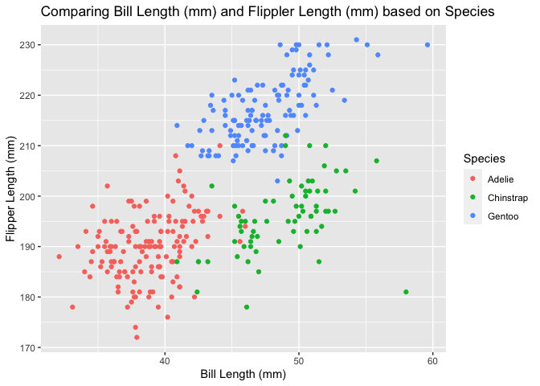

p8105_hw_ef2721
================
Erfan Faridmoayer
Fall 2022

``` r
# Before starting the code, introduced two libraries, and made sure code chunks are visible in the github output.

knitr::opts_chunk$set(echo = TRUE)
library(tidyverse)
```

    ## ── Attaching packages ─────────────────────────────────────── tidyverse 1.3.2 ──
    ## ✔ ggplot2 3.3.6     ✔ purrr   0.3.4
    ## ✔ tibble  3.1.7     ✔ dplyr   1.0.9
    ## ✔ tidyr   1.2.0     ✔ stringr 1.4.0
    ## ✔ readr   2.1.2     ✔ forcats 0.5.2
    ## ── Conflicts ────────────────────────────────────────── tidyverse_conflicts() ──
    ## ✖ dplyr::filter() masks stats::filter()
    ## ✖ dplyr::lag()    masks stats::lag()

``` r
library(gtsummary)
```

## Problem 1

This is a code chunk for importing the data about penguins.

``` r
data("penguins", package = "palmerpenguins")
f = penguins$flipper_length_mm
```

``` r
# I first wanted to change the column names for better table presentation
peng_df = penguins

colnames(peng_df)[colnames(peng_df) == "species"] = "Species"
colnames(peng_df)[colnames(peng_df) == "island"] = "Island"
colnames(peng_df)[colnames(peng_df) == "bill_length_mm"] = "Bill Length (mm)"
colnames(peng_df)[colnames(peng_df) == "bill_depth_mm"] = "Bill Depth (mm)"
colnames(peng_df)[colnames(peng_df) == "flipper_length_mm"] = "Flipper Length (mm)"
colnames(peng_df)[colnames(peng_df) == "body_mass_g"] = "Body Mass (g)"
colnames(peng_df)[colnames(peng_df) == "sex"] = "Sex"
colnames(peng_df)[colnames(peng_df) == "year"] = "Year"

# Used the gtsummary library to showcase the dataset description in a table, with statistical variables. In doing so, removed the NA variables using the 'missing' function.
tab1 = tbl_summary(peng_df, by = Island, missing ="no")
tab1
```

<div id="wnsmudrwef" style="overflow-x:auto;overflow-y:auto;width:auto;height:auto;">
<style>html {
  font-family: -apple-system, BlinkMacSystemFont, 'Segoe UI', Roboto, Oxygen, Ubuntu, Cantarell, 'Helvetica Neue', 'Fira Sans', 'Droid Sans', Arial, sans-serif;
}

#wnsmudrwef .gt_table {
  display: table;
  border-collapse: collapse;
  margin-left: auto;
  margin-right: auto;
  color: #333333;
  font-size: 16px;
  font-weight: normal;
  font-style: normal;
  background-color: #FFFFFF;
  width: auto;
  border-top-style: solid;
  border-top-width: 2px;
  border-top-color: #A8A8A8;
  border-right-style: none;
  border-right-width: 2px;
  border-right-color: #D3D3D3;
  border-bottom-style: solid;
  border-bottom-width: 2px;
  border-bottom-color: #A8A8A8;
  border-left-style: none;
  border-left-width: 2px;
  border-left-color: #D3D3D3;
}

#wnsmudrwef .gt_heading {
  background-color: #FFFFFF;
  text-align: center;
  border-bottom-color: #FFFFFF;
  border-left-style: none;
  border-left-width: 1px;
  border-left-color: #D3D3D3;
  border-right-style: none;
  border-right-width: 1px;
  border-right-color: #D3D3D3;
}

#wnsmudrwef .gt_title {
  color: #333333;
  font-size: 125%;
  font-weight: initial;
  padding-top: 4px;
  padding-bottom: 4px;
  padding-left: 5px;
  padding-right: 5px;
  border-bottom-color: #FFFFFF;
  border-bottom-width: 0;
}

#wnsmudrwef .gt_subtitle {
  color: #333333;
  font-size: 85%;
  font-weight: initial;
  padding-top: 0;
  padding-bottom: 6px;
  padding-left: 5px;
  padding-right: 5px;
  border-top-color: #FFFFFF;
  border-top-width: 0;
}

#wnsmudrwef .gt_bottom_border {
  border-bottom-style: solid;
  border-bottom-width: 2px;
  border-bottom-color: #D3D3D3;
}

#wnsmudrwef .gt_col_headings {
  border-top-style: solid;
  border-top-width: 2px;
  border-top-color: #D3D3D3;
  border-bottom-style: solid;
  border-bottom-width: 2px;
  border-bottom-color: #D3D3D3;
  border-left-style: none;
  border-left-width: 1px;
  border-left-color: #D3D3D3;
  border-right-style: none;
  border-right-width: 1px;
  border-right-color: #D3D3D3;
}

#wnsmudrwef .gt_col_heading {
  color: #333333;
  background-color: #FFFFFF;
  font-size: 100%;
  font-weight: normal;
  text-transform: inherit;
  border-left-style: none;
  border-left-width: 1px;
  border-left-color: #D3D3D3;
  border-right-style: none;
  border-right-width: 1px;
  border-right-color: #D3D3D3;
  vertical-align: bottom;
  padding-top: 5px;
  padding-bottom: 6px;
  padding-left: 5px;
  padding-right: 5px;
  overflow-x: hidden;
}

#wnsmudrwef .gt_column_spanner_outer {
  color: #333333;
  background-color: #FFFFFF;
  font-size: 100%;
  font-weight: normal;
  text-transform: inherit;
  padding-top: 0;
  padding-bottom: 0;
  padding-left: 4px;
  padding-right: 4px;
}

#wnsmudrwef .gt_column_spanner_outer:first-child {
  padding-left: 0;
}

#wnsmudrwef .gt_column_spanner_outer:last-child {
  padding-right: 0;
}

#wnsmudrwef .gt_column_spanner {
  border-bottom-style: solid;
  border-bottom-width: 2px;
  border-bottom-color: #D3D3D3;
  vertical-align: bottom;
  padding-top: 5px;
  padding-bottom: 5px;
  overflow-x: hidden;
  display: inline-block;
  width: 100%;
}

#wnsmudrwef .gt_group_heading {
  padding-top: 8px;
  padding-bottom: 8px;
  padding-left: 5px;
  padding-right: 5px;
  color: #333333;
  background-color: #FFFFFF;
  font-size: 100%;
  font-weight: initial;
  text-transform: inherit;
  border-top-style: solid;
  border-top-width: 2px;
  border-top-color: #D3D3D3;
  border-bottom-style: solid;
  border-bottom-width: 2px;
  border-bottom-color: #D3D3D3;
  border-left-style: none;
  border-left-width: 1px;
  border-left-color: #D3D3D3;
  border-right-style: none;
  border-right-width: 1px;
  border-right-color: #D3D3D3;
  vertical-align: middle;
}

#wnsmudrwef .gt_empty_group_heading {
  padding: 0.5px;
  color: #333333;
  background-color: #FFFFFF;
  font-size: 100%;
  font-weight: initial;
  border-top-style: solid;
  border-top-width: 2px;
  border-top-color: #D3D3D3;
  border-bottom-style: solid;
  border-bottom-width: 2px;
  border-bottom-color: #D3D3D3;
  vertical-align: middle;
}

#wnsmudrwef .gt_from_md > :first-child {
  margin-top: 0;
}

#wnsmudrwef .gt_from_md > :last-child {
  margin-bottom: 0;
}

#wnsmudrwef .gt_row {
  padding-top: 8px;
  padding-bottom: 8px;
  padding-left: 5px;
  padding-right: 5px;
  margin: 10px;
  border-top-style: solid;
  border-top-width: 1px;
  border-top-color: #D3D3D3;
  border-left-style: none;
  border-left-width: 1px;
  border-left-color: #D3D3D3;
  border-right-style: none;
  border-right-width: 1px;
  border-right-color: #D3D3D3;
  vertical-align: middle;
  overflow-x: hidden;
}

#wnsmudrwef .gt_stub {
  color: #333333;
  background-color: #FFFFFF;
  font-size: 100%;
  font-weight: initial;
  text-transform: inherit;
  border-right-style: solid;
  border-right-width: 2px;
  border-right-color: #D3D3D3;
  padding-left: 5px;
  padding-right: 5px;
}

#wnsmudrwef .gt_stub_row_group {
  color: #333333;
  background-color: #FFFFFF;
  font-size: 100%;
  font-weight: initial;
  text-transform: inherit;
  border-right-style: solid;
  border-right-width: 2px;
  border-right-color: #D3D3D3;
  padding-left: 5px;
  padding-right: 5px;
  vertical-align: top;
}

#wnsmudrwef .gt_row_group_first td {
  border-top-width: 2px;
}

#wnsmudrwef .gt_summary_row {
  color: #333333;
  background-color: #FFFFFF;
  text-transform: inherit;
  padding-top: 8px;
  padding-bottom: 8px;
  padding-left: 5px;
  padding-right: 5px;
}

#wnsmudrwef .gt_first_summary_row {
  border-top-style: solid;
  border-top-color: #D3D3D3;
}

#wnsmudrwef .gt_first_summary_row.thick {
  border-top-width: 2px;
}

#wnsmudrwef .gt_last_summary_row {
  padding-top: 8px;
  padding-bottom: 8px;
  padding-left: 5px;
  padding-right: 5px;
  border-bottom-style: solid;
  border-bottom-width: 2px;
  border-bottom-color: #D3D3D3;
}

#wnsmudrwef .gt_grand_summary_row {
  color: #333333;
  background-color: #FFFFFF;
  text-transform: inherit;
  padding-top: 8px;
  padding-bottom: 8px;
  padding-left: 5px;
  padding-right: 5px;
}

#wnsmudrwef .gt_first_grand_summary_row {
  padding-top: 8px;
  padding-bottom: 8px;
  padding-left: 5px;
  padding-right: 5px;
  border-top-style: double;
  border-top-width: 6px;
  border-top-color: #D3D3D3;
}

#wnsmudrwef .gt_striped {
  background-color: rgba(128, 128, 128, 0.05);
}

#wnsmudrwef .gt_table_body {
  border-top-style: solid;
  border-top-width: 2px;
  border-top-color: #D3D3D3;
  border-bottom-style: solid;
  border-bottom-width: 2px;
  border-bottom-color: #D3D3D3;
}

#wnsmudrwef .gt_footnotes {
  color: #333333;
  background-color: #FFFFFF;
  border-bottom-style: none;
  border-bottom-width: 2px;
  border-bottom-color: #D3D3D3;
  border-left-style: none;
  border-left-width: 2px;
  border-left-color: #D3D3D3;
  border-right-style: none;
  border-right-width: 2px;
  border-right-color: #D3D3D3;
}

#wnsmudrwef .gt_footnote {
  margin: 0px;
  font-size: 90%;
  padding-left: 4px;
  padding-right: 4px;
  padding-left: 5px;
  padding-right: 5px;
}

#wnsmudrwef .gt_sourcenotes {
  color: #333333;
  background-color: #FFFFFF;
  border-bottom-style: none;
  border-bottom-width: 2px;
  border-bottom-color: #D3D3D3;
  border-left-style: none;
  border-left-width: 2px;
  border-left-color: #D3D3D3;
  border-right-style: none;
  border-right-width: 2px;
  border-right-color: #D3D3D3;
}

#wnsmudrwef .gt_sourcenote {
  font-size: 90%;
  padding-top: 4px;
  padding-bottom: 4px;
  padding-left: 5px;
  padding-right: 5px;
}

#wnsmudrwef .gt_left {
  text-align: left;
}

#wnsmudrwef .gt_center {
  text-align: center;
}

#wnsmudrwef .gt_right {
  text-align: right;
  font-variant-numeric: tabular-nums;
}

#wnsmudrwef .gt_font_normal {
  font-weight: normal;
}

#wnsmudrwef .gt_font_bold {
  font-weight: bold;
}

#wnsmudrwef .gt_font_italic {
  font-style: italic;
}

#wnsmudrwef .gt_super {
  font-size: 65%;
}

#wnsmudrwef .gt_footnote_marks {
  font-style: italic;
  font-weight: normal;
  font-size: 75%;
  vertical-align: 0.4em;
}

#wnsmudrwef .gt_asterisk {
  font-size: 100%;
  vertical-align: 0;
}

#wnsmudrwef .gt_indent_1 {
  text-indent: 5px;
}

#wnsmudrwef .gt_indent_2 {
  text-indent: 10px;
}

#wnsmudrwef .gt_indent_3 {
  text-indent: 15px;
}

#wnsmudrwef .gt_indent_4 {
  text-indent: 20px;
}

#wnsmudrwef .gt_indent_5 {
  text-indent: 25px;
}
</style>
<table class="gt_table">
  
  <thead class="gt_col_headings">
    <tr>
      <th class="gt_col_heading gt_columns_bottom_border gt_left" rowspan="1" colspan="1" scope="col"><strong>Characteristic</strong></th>
      <th class="gt_col_heading gt_columns_bottom_border gt_center" rowspan="1" colspan="1" scope="col"><strong>Biscoe</strong>, N = 168<sup class="gt_footnote_marks">1</sup></th>
      <th class="gt_col_heading gt_columns_bottom_border gt_center" rowspan="1" colspan="1" scope="col"><strong>Dream</strong>, N = 124<sup class="gt_footnote_marks">1</sup></th>
      <th class="gt_col_heading gt_columns_bottom_border gt_center" rowspan="1" colspan="1" scope="col"><strong>Torgersen</strong>, N = 52<sup class="gt_footnote_marks">1</sup></th>
    </tr>
  </thead>
  <tbody class="gt_table_body">
    <tr><td class="gt_row gt_left">Species</td>
<td class="gt_row gt_center"></td>
<td class="gt_row gt_center"></td>
<td class="gt_row gt_center"></td></tr>
    <tr><td class="gt_row gt_left" style="text-align: left; text-indent: 10px;">Adelie</td>
<td class="gt_row gt_center">44 (26%)</td>
<td class="gt_row gt_center">56 (45%)</td>
<td class="gt_row gt_center">52 (100%)</td></tr>
    <tr><td class="gt_row gt_left" style="text-align: left; text-indent: 10px;">Chinstrap</td>
<td class="gt_row gt_center">0 (0%)</td>
<td class="gt_row gt_center">68 (55%)</td>
<td class="gt_row gt_center">0 (0%)</td></tr>
    <tr><td class="gt_row gt_left" style="text-align: left; text-indent: 10px;">Gentoo</td>
<td class="gt_row gt_center">124 (74%)</td>
<td class="gt_row gt_center">0 (0%)</td>
<td class="gt_row gt_center">0 (0%)</td></tr>
    <tr><td class="gt_row gt_left">Bill Length (mm)</td>
<td class="gt_row gt_center">45.8 (42.0, 48.7)</td>
<td class="gt_row gt_center">44.7 (39.2, 49.8)</td>
<td class="gt_row gt_center">38.9 (36.7, 41.1)</td></tr>
    <tr><td class="gt_row gt_left">Bill Depth (mm)</td>
<td class="gt_row gt_center">15.50 (14.50, 17.00)</td>
<td class="gt_row gt_center">18.40 (17.50, 19.00)</td>
<td class="gt_row gt_center">18.40 (17.35, 19.25)</td></tr>
    <tr><td class="gt_row gt_left">Flipper Length (mm)</td>
<td class="gt_row gt_center">214 (200, 220)</td>
<td class="gt_row gt_center">193 (188, 198)</td>
<td class="gt_row gt_center">191 (187, 195)</td></tr>
    <tr><td class="gt_row gt_left">Body Mass (g)</td>
<td class="gt_row gt_center">4,775 (4,200, 5,325)</td>
<td class="gt_row gt_center">3,688 (3,400, 3,956)</td>
<td class="gt_row gt_center">3,700 (3,338, 4,000)</td></tr>
    <tr><td class="gt_row gt_left">Sex</td>
<td class="gt_row gt_center"></td>
<td class="gt_row gt_center"></td>
<td class="gt_row gt_center"></td></tr>
    <tr><td class="gt_row gt_left" style="text-align: left; text-indent: 10px;">female</td>
<td class="gt_row gt_center">80 (49%)</td>
<td class="gt_row gt_center">61 (50%)</td>
<td class="gt_row gt_center">24 (51%)</td></tr>
    <tr><td class="gt_row gt_left" style="text-align: left; text-indent: 10px;">male</td>
<td class="gt_row gt_center">83 (51%)</td>
<td class="gt_row gt_center">62 (50%)</td>
<td class="gt_row gt_center">23 (49%)</td></tr>
    <tr><td class="gt_row gt_left">Year</td>
<td class="gt_row gt_center"></td>
<td class="gt_row gt_center"></td>
<td class="gt_row gt_center"></td></tr>
    <tr><td class="gt_row gt_left" style="text-align: left; text-indent: 10px;">2007</td>
<td class="gt_row gt_center">44 (26%)</td>
<td class="gt_row gt_center">46 (37%)</td>
<td class="gt_row gt_center">20 (38%)</td></tr>
    <tr><td class="gt_row gt_left" style="text-align: left; text-indent: 10px;">2008</td>
<td class="gt_row gt_center">64 (38%)</td>
<td class="gt_row gt_center">34 (27%)</td>
<td class="gt_row gt_center">16 (31%)</td></tr>
    <tr><td class="gt_row gt_left" style="text-align: left; text-indent: 10px;">2009</td>
<td class="gt_row gt_center">60 (36%)</td>
<td class="gt_row gt_center">44 (35%)</td>
<td class="gt_row gt_center">16 (31%)</td></tr>
  </tbody>
  
  <tfoot class="gt_footnotes">
    <tr>
      <td class="gt_footnote" colspan="4"><sup class="gt_footnote_marks">1</sup> n (%); Median (IQR)</td>
    </tr>
  </tfoot>
</table>
</div>

The table above is a desciption of the dataset based on the penguins’
islands.

Here is some more info about our dataset:

-   This dataset includes information about penguins’ species, island of
    origin, gender, bill-length, bill-depth, flipper length, mass, and
    year of data collection.
-   There are a total of **344** penguins in this collection, with **8**
    variables collected.
-   The mean flipper length for these penguins was **200.9152047 mm**.

#### Scatterplot

The code chunk below creates a dataframe and uses it to make a
scatterplot:

``` r
# Here I wanted to make a scatterplot as instructed. First, I introduced a dataframe on which variables to include

plot_df = tibble(
    a = penguins$bill_length_mm,
    b = penguins$flipper_length_mm,
    c = penguins$species
)

#Here, I coded for the scatterplot using the plot_df

gp = ggplot(
    plot_df,
    aes(x = a, y = b, color = c)) +
    geom_point() +
    labs(title = "Comparing Bill Length (mm) and Flippler Length (mm) based on Species", color = "Species") +
    xlab("Bill Length (mm)") +
    ylab("Flipper Length (mm)")
gp
```

    ## Warning: Removed 2 rows containing missing values (geom_point).

<!-- -->

``` r
# I saved the scatterplot in a folder in my directory
ggsave
```

    ## function (filename, plot = last_plot(), device = NULL, path = NULL, 
    ##     scale = 1, width = NA, height = NA, units = c("in", "cm", 
    ##         "mm", "px"), dpi = 300, limitsize = TRUE, bg = NULL, 
    ##     ...) 
    ## {
    ##     dpi <- parse_dpi(dpi)
    ##     dev <- plot_dev(device, filename, dpi = dpi)
    ##     dim <- plot_dim(c(width, height), scale = scale, units = units, 
    ##         limitsize = limitsize, dpi = dpi)
    ##     if (!is.null(path)) {
    ##         filename <- file.path(path, filename)
    ##     }
    ##     if (is_null(bg)) {
    ##         bg <- calc_element("plot.background", plot_theme(plot))$fill %||% 
    ##             "transparent"
    ##     }
    ##     old_dev <- grDevices::dev.cur()
    ##     dev(filename = filename, width = dim[1], height = dim[2], 
    ##         bg = bg, ...)
    ##     on.exit(utils::capture.output({
    ##         grDevices::dev.off()
    ##         if (old_dev > 1) grDevices::dev.set(old_dev)
    ##     }))
    ##     grid.draw(plot)
    ##     invisible(filename)
    ## }
    ## <bytecode: 0x7f7fdd50bf98>
    ## <environment: namespace:ggplot2>

## Problem 2

This is a code chunk using normal sampling and character vectors.

``` r
# I introduced a dataframe to include a tibble with the requested characters.

prob2_df = tibble(
    norm_samp = rnorm(10, mean = 5),
    norm_samp_pos = norm_samp > 0,
    vec_char = c("I", "would", "like", "to", "make", "a", "character", "vector", "plot", "here"),
    vec_factor = factor(c("blue", "blue", "red", "white", "red", "blue", "white", "red", "blue", "white"))
)
```

The mean for a sample of 10 with normal distribution and a mean of 5 is
**5.1545852**, and for the positive sample of 10 with normal
distribution is **1**. The means for the vector characters and factors
came out as **NA** and **NA**, respectively. The latter did not result
in a value as the characters were not numeric.

This is a code chunk with attempt to convert variables:

``` r
mean(as.numeric(pull(prob2_df, vec_char)))
```

    ## Warning in mean(as.numeric(pull(prob2_df, vec_char))): NAs introduced by
    ## coercion

    ## [1] NA

``` r
mean(as.numeric(pull(prob2_df, vec_factor)))
```

    ## [1] 1.9

It can be seen from the code chunk above that a character vector still
could not be converted to a numeric output, whereas a factor vector lead
to a numerical mean of **1.9**.
